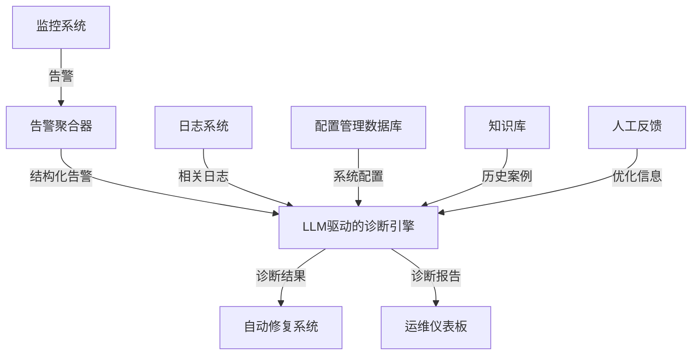
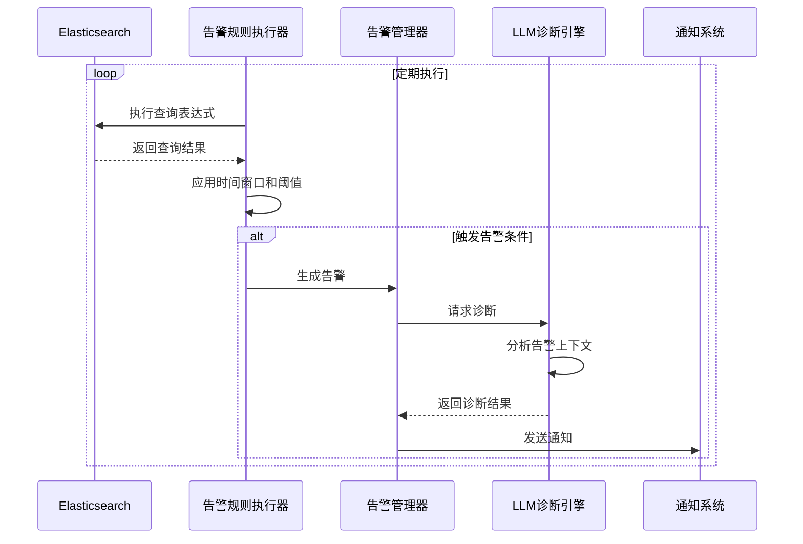
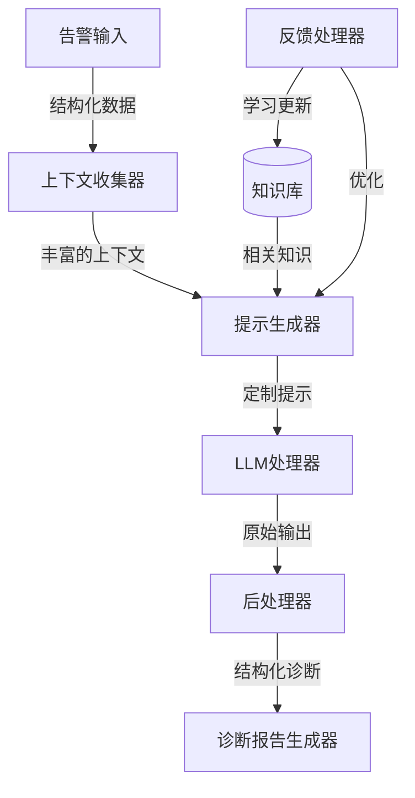

在当今复杂的IT环境中，快速准确地诊断和解决系统问题变得越来越具有挑战性。本文将探讨如何设计一个由大语言模型（LLM）驱动的诊断引擎，作为自动定位系统的核心组件，以智能化方式处理系统告警。
<!--more-->
## 引言

随着系统规模和复杂性的增加，传统的基于规则的告警诊断方法往往力不从心。我们需要一种更智能、更灵活的方法来分析和诊断系统告警。这就是LLM驱动的诊断引擎发挥作用的地方。

## 宏观系统架构：自动定位系统

在深入探讨LLM驱动的诊断引擎之前，让我们先了解它在整个自动定位系统中的位置。自动定位系统是一个复杂的生态系统，旨在自动检测、诊断和解决IT环境中的问题。以下是系统的宏观架构：



以Elasticsearch作为数据源为例:




在这个宏观架构中，LLM驱动的诊断引擎扮演着核心角色：

1. **数据汇聚点**：它接收来自监控系统的结构化告警、日志系统的相关日志、配置管理数据库的系统配置信息，以及知识库中的历史案例。

2. **智能分析中心**：利用这些输入，诊断引擎进行深度分析，识别问题的根本原因。

3. **决策支持**：它为自动修复系统提供精确的诊断结果，指导后续的修复操作。

4. **信息展示**：通过运维仪表板，它为运维团队提供直观的诊断报告。

5. **持续学习**：通过处理人工反馈，诊断引擎不断优化其性能。

现在，让我们深入了解LLM驱动的诊断引擎的内部架构和工作原理。

## LLM驱动的诊断引擎架构

我们的LLM驱动的诊断引擎架构包括以下核心组件：

1. 上下文收集器
2. 提示生成器
3. LLM处理器
4. 后处理器
5. 诊断报告生成器
6. 反馈处理器

让我们通过一个图表来直观地了解这些组件是如何协同工作的：



## 详细组件设计

### 1. 上下文收集器

上下文收集器的主要任务是收集与告警相关的所有必要信息。这包括系统状态、相关日志、历史告警等。

```python
async def collect_context(alert_data):
    context = {
        "alert": alert_data,
        "system_state": await get_system_state(),
        "related_logs": await fetch_related_logs(alert_data),
        "historical_alerts": await get_historical_alerts(alert_data['query']),
        "current_config": await fetch_current_config()
    }
    return context
```

### 2. 提示生成器

提示生成器负责创建针对特定告警的定制LLM提示。它使用模板系统并集成知识库中的相关信息。

```python
def generate_prompt(context, knowledge):
    template = """
    分析以下告警情况：
    {alert_description}
    
    系统当前状态：
    {system_state}
    
    相关日志：
    {related_logs}
    
    历史告警情况：
    {historical_alerts}
    
    当前配置：
    {current_config}
    
    相关知识：
    {relevant_knowledge}
    
    请提供：
    1. 可能的根本原因分析
    2. 潜在的系统影响
    3. 建议的调查步骤
    4. 可能的解决方案
    """
    return template.format(
        alert_description=context['alert'],
        system_state=context['system_state'],
        related_logs=summarize_logs(context['related_logs']),
        historical_alerts=summarize_historical_alerts(context['historical_alerts']),
        current_config=context['current_config'],
        relevant_knowledge=knowledge
    )
```

### 3. LLM处理器

LLM处理器管理与大语言模型的交互，处理重试、超时和错误。

```python
async def process_with_llm(prompt):
    try:
        response = await llm_client.generate(prompt, max_tokens=1000)
        return response.choices[0].text
    except Exception as e:
        logger.error(f"LLM处理错误: {e}")
        return None
```

### 4. 后处理器

后处理器解析和结构化LLM的输出，应用规则基础的验证和增强。

```python
def postprocess_llm_output(raw_output):
    sections = extract_sections(raw_output)
    enhanced_sections = apply_enhancement_rules(sections)
    return {
        "root_cause": enhanced_sections.get("根本原因分析"),
        "impact": enhanced_sections.get("潜在的系统影响"),
        "investigation_steps": enhanced_sections.get("建议的调查步骤"),
        "solutions": enhanced_sections.get("可能的解决方案"),
        "confidence_score": calculate_confidence_score(enhanced_sections)
    }
```

### 5. 诊断报告生成器

诊断报告生成器创建结构化和易读的诊断报告，支持多种输出格式。

```python
def generate_diagnostic_report(processed_diagnosis, context):
    report = {
        "alert_summary": summarize_alert(context['alert']),
        "diagnosis": processed_diagnosis,
        "visualizations": generate_visualizations(context, processed_diagnosis),
        "recommendations": prioritize_recommendations(processed_diagnosis['solutions']),
        "metadata": {
            "generated_at": datetime.now().isoformat(),
            "model_version": llm_client.model_version,
            "confidence_score": processed_diagnosis['confidence_score']
        }
    }
    return render_report_template(report)
```

### 6. 反馈处理器

反馈处理器收集用户反馈，更新知识库并优化提示模板。

```python
async def process_feedback(diagnosis_id, feedback):
    diagnosis = await fetch_diagnosis(diagnosis_id)
    await update_knowledge_base(diagnosis, feedback)
    await optimize_prompt_template(diagnosis['prompt'], feedback)
    await update_model_performance_metrics(feedback)
```

## 集成与优化

为了提高系统的性能和可扩展性，我们采用了以下策略：

1. 使用异步编程提高并发处理能力
2. 实现缓存机制，避免重复处理相似的告警
3. 使用流处理架构（如Apache Kafka）来处理大规模告警
4. 实现金丝雀发布和A/B测试，以安全地推出新的诊断策略

## 持续改进

为了确保诊断引擎能够不断提高其性能，我们实施了以下措施：

1. 建立反馈循环，不断优化LLM提示和后处理规则
2. 定期评审诊断性能，识别改进机会
3. 考虑集成多个LLM模型，根据不同类型的告警选择最适合的模型

## 与自动定位系统的集成

LLM驱动的诊断引擎通过以下方式与自动定位系统的其他组件集成：

1. **告警接收**：通过标准化的API接口从告警聚合器接收结构化告警。

2. **更丰富的上下文**：
   - 从日志系统拉取相关的日志条目
   - 从配置管理数据库获取最新的系统配置信息
   - 从知识库检索相关的历史案例

3. **诊断结果输出**：
   - 向自动修复系统提供结构化的诊断结果，包括建议的修复步骤
   - 将格式化的诊断报告推送到运维仪表板

4. **反馈处理**：
   - 接收来自运维团队的反馈
   - 利用反馈信息优化诊断模型和知识库

## 结论

LLM驱动的诊断引擎作为自动定位系统的核心组件，不仅提供了强大的问题分析能力，还通过与其他组件的紧密集成，实现了端到端的自动化问题检测、诊断和修复流程。这种智能化的方法大大提高了IT运维的效率，减少了人工干预的需求，同时通过持续学习不断提升系统的诊断准确性。