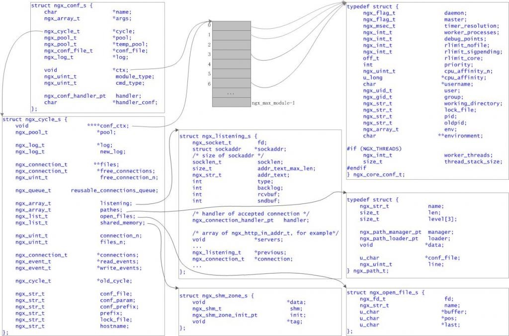

# ngx_cycle_t


```c
typedef struct ngx_cycle_s       ngx_cycle_t;


 
struct ngx_cycle_s {  
    void                  ****conf_ctx;  //配置上下文数组(含所有模块)  
    ngx_pool_t               *pool;      //内存池  
  
    ngx_log_t                *log;       //日志  
    ngx_log_t                 new_log;  
  
    ngx_connection_t        **files;     //连接文件  
    ngx_connection_t         *free_connections;  //空闲连接  
    ngx_uint_t                free_connection_n; //空闲连接个数  
  
    ngx_queue_t               reusable_connections_queue;  //再利用连接队列  
  
    ngx_array_t               listening;     //监听数组  
    ngx_array_t               pathes;        //路径数组  
    ngx_list_t                open_files;    //打开文件链表  
    ngx_list_t                shared_memory; //共享内存链表  
  
    ngx_uint_t                connection_n;  //连接个数  
    ngx_uint_t                files_n;       //打开文件个数  
  
    ngx_connection_t         *connections;   //连接  
    ngx_event_t              *read_events;   //读事件  
    ngx_event_t              *write_events;  //写事件  
  
    ngx_cycle_t              *old_cycle;     //old cycle指针  
  
    ngx_str_t                 conf_file;     //配置文件  
    ngx_str_t                 conf_param;    //配置参数  
    ngx_str_t                 conf_prefix;   //配置前缀  
    ngx_str_t                 prefix;        //前缀  
    ngx_str_t                 lock_file;     //锁文件  
    ngx_str_t                 hostname;      //主机名  
};  
```




